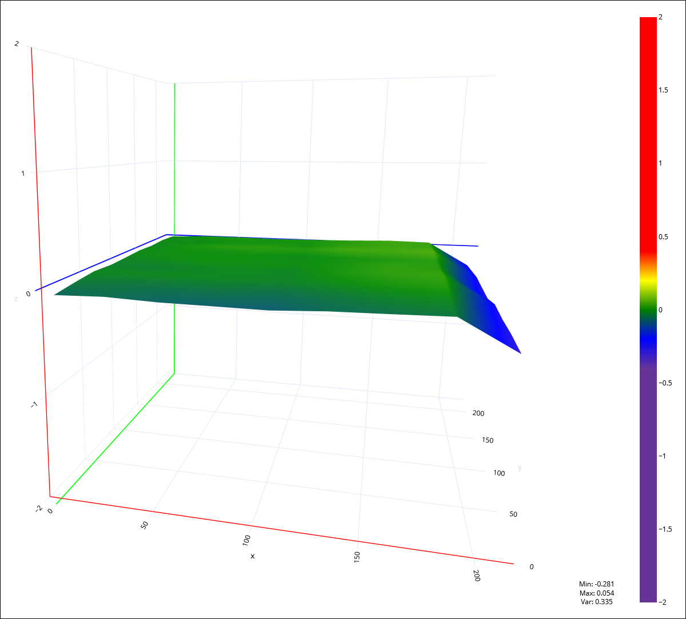

# Marlin-H32

Just forking [alexqzd/Marlin-H32](https://github.com/alexqzd/Marlin-H32) to fix my probing issues using a Creality CR-Touch probe on a Voxelab Aquila X2 with H32 board using this [CR-Touch mount by LightValen](https://www.thingiverse.com/thing:4974329) with the stock shroud. The default probing margin is set too small in Alex's firmware, even with the default probe offset values (default X offset value: -40.0 mm, measured value with LightValen's mount: -42.5 mm). When creating a new mesh, this small margin causes the X carriage to bump into the right printer frame, tensile strain on the X axis belt, and wrong measurements at the most right probing points. This recompilation of Alex's firmware sets the probing margin from 20 mm to 30 mm to solve this problem.

⚠️Please note that Alex does not maintain his Marlin firmwares anymore. But hey, they're still usable and superior to the stock firmware for those we do not want to use Klipper firmwares.

*Inaccurate measurements on the most right probing points due to the X carriage bumping into the right printer frame caused by a small probing margin.*

## Flashing the firmware

The `assets` folder in this repository also includes a [copy of the Voxelab themed display assets](https://github.com/alexqzd/Marlin/tree/v1.3.5.1). You can skip flashing the screen assets (steps 2 and 3) if you're already running Alex's firmware version 1.3.6.

1. Format a SD card as FAT32 with a cluster size of 4096 bytes.
2. Download [the source code from the release page](https://github.com/vuhuy/Marlin-H32/releases/) to obtain the display assets.
3. In the source code archive, extract and copy the  `DWIN_SET` folder (located in `assets`) to the root your formatted SD card.
4. Download one of the [precompiled binaries from the release page](https://github.com/vuhuy/Marlin-H32/releases/) for the firmware upgrade. I've chosen `BLTouch-9x9-H32.bin` (also works for CR-Touch, 9x9 for 81 probing points, non high-speed HS).
5. Create a folder on the SD card root named `firmware` and copy the download BIN file into that folder.
6. Make sure your Aquila X2 is turned off, insert the prepared SD card into the printer base and turn the machine on.
7. It will start to flash firmware immediately. If it's booting into normal operation mode, your SD card is not prepared correctly. It will show a broken progress bar and come back alive after while. The screen might show mangled graphics when flashing is done.
8. Turn off the machine to flash the display assets. Remove the SD card, disconnect and dismount the screen from the printer base.
9. Unscrew the back cover from the screen to access a hidden SD card reader. You don't have to remove the mount from the display module. Insert the SD card, and reconnect the screen. It's better to not reassembly the whole thing at this point.
10. Start your machine. If your SD card is prepared correctly, you will be greeted with a blue screen. When flashing the screen assets is done, the screen will flash orange.
11. Turn off the machine, remove the SD card, and turn on the machine to verify the printer is working correctly. Reassemble the printer if everything works fine.